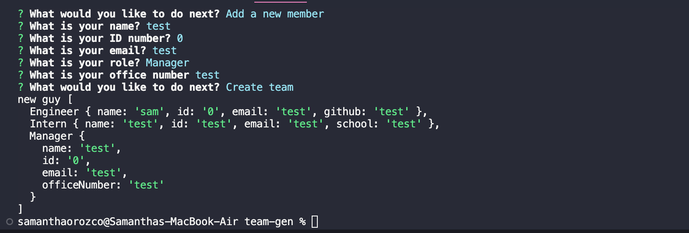

# team-gen

## Description

This webpage was created to generate an html page generating a team. The user answers questions given and has the choice to add new team members or finish and create the team. Once the team is created, it reveals the html with updated information. This webpage displayed the acquired skills learned throughout the course displaying knowledge on HTML, CSS, CSS Framework Bootstrap, JavaScript and NodeJS. 

## Tasks
- Display data pulled from questions user answers in html format through terminal.
- When finished with one staff member I am prompted to add a new member or create the html.
- When all prompts are answered, the new html is generated.

## Usage

- Link to Deployed Application: https://github.com/izbeloro/team-gen
- Github Repo: https://github.com/izbeloro/team-gen
- Video Walkthrough: https://drive.google.com/file/d/1EoYNv87Q9KQChHndb2_LibTKn2oTu9nf/view

To use this challenge, you have to run node. It then asks you a series of questions regarding your name, position, ID and phone number. From there it lets you build a team consisting of Intern, Manager, Employee, and Engineer. After all the questions are answered, it then creates a webpage containing all the information.

## Credits

- https://www.makeareadme.com/#license-1
- https://www.digitalocean.com/community/tutorials/how-to-write-and-run-your-first-program-in-node-js
- https://www.exefiles.com/en/js/node-js/
- https://medium.com/northcoders/creating-a-project-generator-with-node-29e13b3cd309

## License

MIT License

Copyright (c) [2023] [SamanthaOrozco]

Permission is hereby granted, free of charge, to any person obtaining a copy
of this software and associated documentation files (the "Software"), to deal
in the Software without restriction, including without limitation the rights
to use, copy, modify, merge, publish, distribute, sublicense, and/or sell
copies of the Software, and to permit persons to whom the Software is
furnished to do so, subject to the following conditions:

The above copyright notice and this permission notice shall be included in all
copies or substantial portions of the Software.

THE SOFTWARE IS PROVIDED "AS IS", WITHOUT WARRANTY OF ANY KIND, EXPRESS OR
IMPLIED, INCLUDING BUT NOT LIMITED TO THE WARRANTIES OF MERCHANTABILITY,
FITNESS FOR A PARTICULAR PURPOSE AND NONINFRINGEMENT. IN NO EVENT SHALL THE
AUTHORS OR COPYRIGHT HOLDERS BE LIABLE FOR ANY CLAIM, DAMAGES OR OTHER
LIABILITY, WHETHER IN AN ACTION OF CONTRACT, TORT OR OTHERWISE, ARISING FROM,
OUT OF OR IN CONNECTION WITH THE SOFTWARE OR THE USE OR OTHER DEALINGS IN THE
SOFTWARE.
